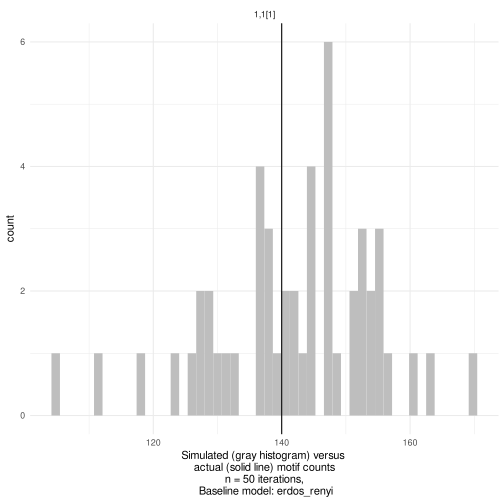
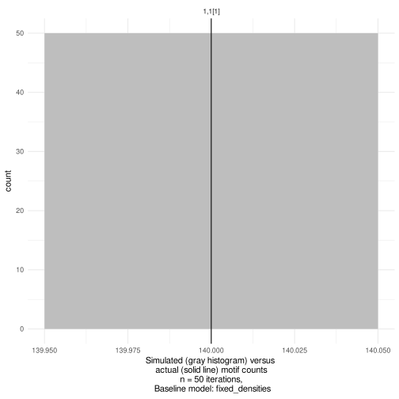
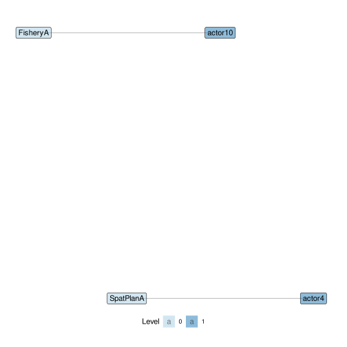
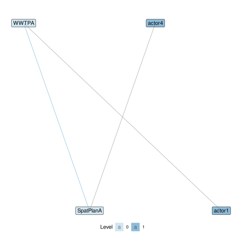
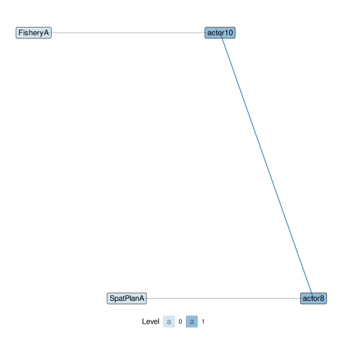
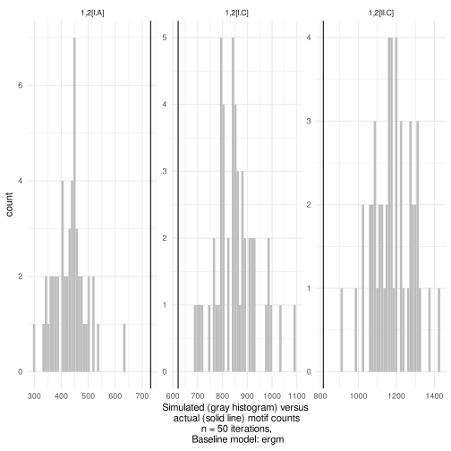
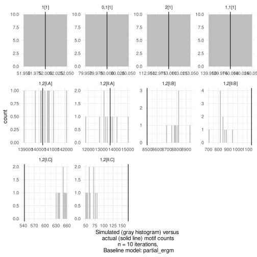

<a href='https://marioangst.github.io/motifr/'></a>


This vignette describes the models used to specify baseline motif distributions to compare empirically observed networks against in motifr. Baseline models have to be specified when requesting random networks to compare empirically observed networks against (e.g. using ``compare_to_baseline()``), and when computing properties of motif distributions analytically (e.g, ``motifs_distribution()``).

## Baseline models

Currently, four baseline models are implemented. The parameters of the models are extracted from a given (empirical) network.

- *Fixed Densities Model* (``fixed_densities``) Given two levels A and B, in this model it is assumed that the number of edges between level A and level B is fixed for all A-B ties.
The specific number of edges is drawn randomly from the set of all possible edges.
- *Erdős-Rényi Model* (``erdos_renyi``) In this model edges _between_ the various levels are drawn independently at random with respect to a fixed probability depending on the levels.
The (refined) Erdős-Rényi model accounts for the various levels by allowing
to specify different probabilities ties occurring _within_ different levels.
- *Actor's Choice Model* (``actors_choice``) In this model all edges but the edges on one specific level are fixed. This is motivated by theoretical considerations about the application of multi-level network models in situations where one level is composed of actors, which are more readily able to change their connections, and other levels considered more stable, e.g. specific instances of ecological networks. The edges on this non-fixed "actor level" are chosen independently with fixed probability as in Erdős-Rényi.
- *Exponential Random Graph Model* (``ergm``) Sophisticated model which accounts for various network parameters. Please consult the documentation of ``ergm::ergm()`` for details.
- *Partial Exponential Random Graph Model* (``partial_ergm``) It tends to be hard to fit an ERGM to a multi-level network. However, this can be often avoided by using ERGM only for modelling the behaviour of one level while keeping the other levels fixed, motivated by the same theoretical considerations as for the Actor's choice model.

For further details see the [documentation of the Python sma package](https://gitlab.com/t.seppelt/sesmotifanalyser/raw/master/doc/_build/latex/SESMotifAnalyser.pdf?inline=false).

## Motifs in networks simulated based on a baseline model

Motifs in random networks can be counted using ``simulate_baseline()``. The supported models are
``erdos_renyi``, ``fixed_densities``, ``actors_choice`` and ``ergm``. The function ``compare_to_baseline()`` can be used for
plotting the results:


```r
simulate_baseline(ml_net, motifs = list("1,2[I.C]", "1,2[II.C]"), n = 5, directed = FALSE)
#>   1,2[I.C] 1,2[II.C]
#> 1      179        19
#> 2      183        21
#> 3      247        22
#> 4      147        19
#> 5      122        12
```

## Motif distributions without simulation

Expectations and variances in ``erdos_renyi`` and ``actors_choice`` can be computed analytically, i.e. without simulating hundreds of random networks. Until now variances can only be computed for 1,2-motifs.


```r
motifs_distribution(ml_net, motifs = list("1,2[I.C]", "2,2[II.D]"), directed = FALSE)
#>               motif expectation variance
#> 1,2[I.C]   1,2[I.C]   169.14423 949.7743
#> 2,2[II.D] 2,2[II.D]    68.83919 968.5823
```

## Difference between Erdős-Rényi and Fixed Densities

There is a crucial difference between the Erdős-Rényi model and Fixed Densities model. In the former, the expected number of edges on each level equals the number of edges in the empirical network, while in the latter the exact number in each random network equals this number. This difference becomes obvious when counting edges in random networks. For a network with two levels A and B ``1,1[1]`` is the motif consisting of one node from level A and one from level B, linked by an edge.


```r
compare_to_baseline(ml_net, motifs = list("1,1[1]"), model = "erdos_renyi", n = 50, directed = FALSE)
```



```r
compare_to_baseline(ml_net, motifs = list("1,1[1]"), model = "fixed_densities", n = 50, directed = FALSE)
```



## Level selection in Actor's Choice Model

In the Actor's Choice Model all levels in the network except for one are assumed to be fixed. The edges in the remaining variable (or actor's) level are drawn randomly according to the Erdős-Rényi Model. The variable level can be selected using the ``level`` parameter, e.g. in ``motifs_distribution()``, or determined automatically. The default level is the first level providing exactly two nodes in the motif. Note that ``simulate_baseline()`` and ``compare_to_baseline()`` do not support automatic level selection.

Let's consider an example. Assume that the variable level is level zero. The edges in the other levels are fixed. The expected number of closed triangles with two nodes on the variable level can be computed as follows. Here ``level`` is automatically determined to be 0.


```r
motifs_distribution(ml_net, motifs = list("2,1[II.C]"), model = "actors_choice", directed = FALSE)
#>       motif expectation variance
#> 1 2,1[II.C]    19.08899 64.54796
```

More interesting is the case of motifs with signature ``2,2``, i.e. with two nodes on two levels. Per default, the variable level is the first level providing two nodes, so level 0 in the first line. Manually, level 1 can be selected as variable level, see second line.


```r
motifs_distribution(ml_net, motifs = list("2,2[I.A]", "2,2[I.B]", "2,2[I.C]", "2,2[I.D]"), model = "actors_choice", directed = FALSE)
#>             motif expectation   variance
#> 2,2[I.A] 2,2[I.A]  3988.44646 20908.0827
#> 2,2[I.B] 2,2[I.B]   371.55354 20908.0827
#> 2,2[I.C] 2,2[I.C]   648.57994   614.8427
#> 2,2[I.D] 2,2[I.D]    60.42006   614.8427
motifs_distribution(ml_net, motifs = list("2,2[I.A]", "2,2[I.B]", "2,2[I.C]", "2,2[I.D]"), model = "actors_choice", level = 1, directed = FALSE)
#>             motif expectation    variance
#> 2,2[I.A] 2,2[I.A]  4506.13165 4146.282609
#> 2,2[I.B] 2,2[I.B]   100.88354    9.525781
#> 2,2[I.C] 2,2[I.C]   451.86835 4146.282609
#> 2,2[I.D] 2,2[I.D]    10.11646    9.525781
```
Note that in the first line, when level 0 is the variable level, motifs I.A and I.B have the same variance. This is because they only differ in the dyad on the variable level. Similarly, in the second line motifs I.A and I.C have the same variance as they only differ in the dyad on the variable level.

```r
show_motif("2,2[I.A]", net = ml_net, label = TRUE, directed = FALSE)
```



```r
show_motif("2,2[I.B]", net = ml_net, label = TRUE, directed = FALSE)
```



```r
show_motif("2,2[I.C]", net = ml_net, label = TRUE, directed = FALSE)
```



## Exponential Random Graph Models (ERGM)

ERGMs are a powerful tool to create more advanced, parameterized baseline models. The R library ``ergm`` provides various facililties for fitting models based on a multitude of network parameters. motifr can be used to analyse random networks sampled from a given fitted ERGM. In the example below, we fit a basic ergm model to ``dummy_net`` including a triangle statistic, capturing a propensity for triangles to occur. We then use the fitted model in a generative way to simulate networks from it and collect to arrive at a baseline distribution based on this model.


```r
model <- ergm(dummy_net ~ edges + triangle)
#> Starting maximum pseudolikelihood estimation (MPLE):
#> Evaluating the predictor and response matrix.
#> Maximizing the pseudolikelihood.
#> Finished MPLE.
#> Starting Monte Carlo maximum likelihood estimation (MCMLE):
#> Iteration 1 of at most 20:
#> Optimizing with step length 1.
#> The log-likelihood improved by 0.02841.
#> Step length converged once. Increasing MCMC sample size.
#> Iteration 2 of at most 20:
#> Optimizing with step length 1.
#> The log-likelihood improved by 0.001053.
#> Step length converged twice. Stopping.
#> Finished MCMLE.
#> Evaluating log-likelihood at the estimate. Using 20 bridges: 1 2 3 4 5 6 7 8 9 10 11 12 13 14 15 16 17 18 19 20 .
#> This model was fit using MCMC.  To examine model diagnostics and check for degeneracy, use the mcmc.diagnostics() function.
compare_to_baseline(dummy_net, list("1,2[I.A]", "1,2[I.C]", "1,2[II.C]"), n = 50, directed = FALSE, model = "ergm", ergm_model = model)
```



## Workflow for Partial ERGM

The example below illustrates the use of a partial ergm model fit on one level of the network to be used as a baseline model. In this way, all ties except ties on one level of interest are kept fixed. On the level of interest, networks are simulated from an ergm fit to this level and used to create a baseline motif distribution in the multi-level network.

To do this, the subgraph containing only one level of the network is first extracted using ``induced_level_subgraph()``, setting the level to extract (here the actor network on level ``1``). This yields a network object only containing this level to fit an ergm to.

As this example is illustrative, we only fit the most basic ergm model possible, using only a density term. As such, what we do amounts to fitting a Erdős-Rényi model on one level of the multi-level network to be used to simulate a baseline from. But the actual power of using an ERGM lies in the fact that it allows the analyst to account for more subtle processes such as clustering, centralization or homophily.

The resulting model fit (here captured in the object named ``actor_ergm_model``) is then used in ``compare_to_baseline()`` by passing it to the parameter ergm_model and setting model to partial_ergm. The level parameter further needs to be set to the correct level where the ergm fit is to be used (here ``1`` again).


```r
net <- motifr::ml_net
actor_net <- motifr::induced_level_subgraph(net, level = 1)

# very simple ergm model
actor_ergm_model <- ergm(actor_net ~ density)
#> Starting maximum pseudolikelihood estimation (MPLE):
#> Evaluating the predictor and response matrix.
#> Maximizing the pseudolikelihood.
#> Finished MPLE.
#> Stopping at the initial estimate.
#> Evaluating log-likelihood at the estimate.

n <- 10
compare_to_baseline(net,
                    list("1[1]", "0,1[1]",
                         "2[1]", "1,1[1]", # "0,2[1]", is variable
                         "1,2[I.A]", "1,2[II.A]",
                         "1,2[I.B]", "1,2[II.B]",
                         "1,2[I.C]", "1,2[II.C]"),
                    model = "partial_ergm",
                    ergm_model = actor_ergm_model,
                    n = n,
                    level = 1)
```


